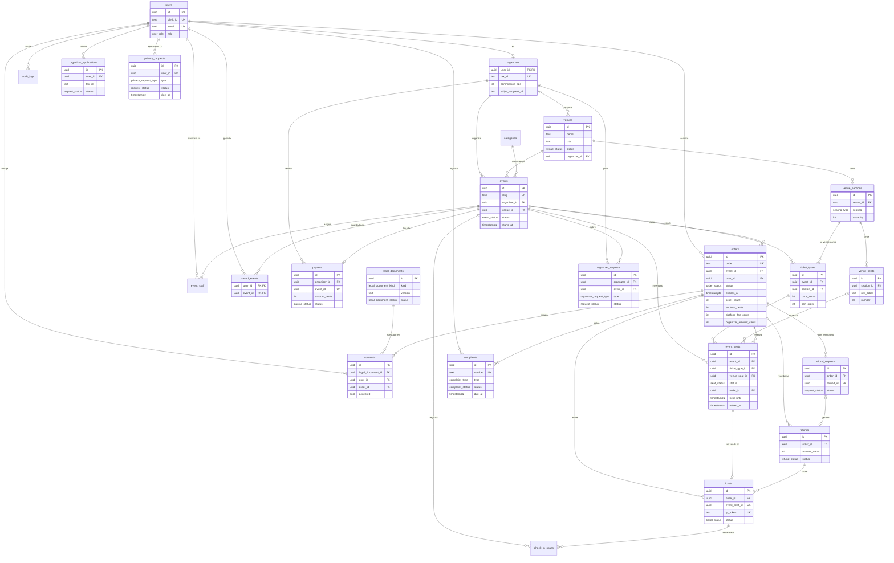

# Modelo de datos (MER) — Ticketera

- Fecha: 2026-10-03
- Arquitectura y flujos: [`system-design.md`](./system-design.md)
- Implementación: esquema Drizzle en `lib/db/schema/*.ts`, migraciones en `drizzle/` (fase F1).

## Convenciones

- PK `uuid` con `gen_random_uuid()`, salvo donde se indica.
- Dinero en `integer` (céntimos). Nunca `float`/`numeric` para importes.
- Fechas en `timestamptz`; se muestran en `America/Lima`.
- Enums nativos de Postgres.
- Todas las tablas tienen `created_at timestamptz NOT NULL DEFAULT now()`; las editables, `updated_at`.
- Nombres en inglés, `snake_case`, tablas en plural.
- 26 tablas.
- Extensiones: `pgcrypto` (si la versión de Postgres no trae `gen_random_uuid()` nativo), `pg_trgm`, `unaccent`.

## Diagrama

Tablas sin relaciones en el diagrama: `stripe_events`, `complaint_counters`.

## Enums

| Enum | Valores |
|---|---|
| `user_role` | `customer`, `organizer`, `admin`, `super_admin` |
| `document_type` | `dni`, `ce`, `passport` |
| `tax_id_type` | `ruc`, `dni` |
| `seating_type` | `general`, `numbered` |
| `venue_status` | `pending_review`, `approved` |
| `event_status` | `draft`, `pending_review`, `published`, `cancelled`, `finished` |
| `seat_status` | `available`, `held`, `sold` |
| `order_status` | `pending`, `paid`, `expired`, `refunded`, `partially_refunded` |
| `ticket_status` | `valid`, `used`, `void`, `refunded` |
| `refund_reason` | `event_cancelled`, `customer`, `admin` |
| `refund_status` | `pending`, `succeeded`, `failed` |
| `scan_result` | `ok`, `already_used`, `invalid`, `wrong_event`, `void` |
| `payout_status` | `pending`, `paid`, `failed` |
| `legal_document_kind` | `terms`, `privacy`, `cookies`, `refunds`, `marketing`, `international_transfer` |
| `legal_document_status` | `draft`, `published` |
| `cookie_category` | `necessary`, `analytics`, `marketing` |
| `complaint_type` | `claim` (reclamo), `grievance` (queja) |
| `complaint_item_type` | `product`, `service` |
| `complaint_status` | `open`, `answered` |
| `request_status` | `pending`, `approved`, `rejected` |
| `organizer_request_type` | `cancel`, `reschedule` |
| `privacy_request_type` | `access`, `rectification`, `cancellation`, `opposition` |

## Diccionario de tablas

Columnas `created_at`/`updated_at` omitidas. `NULL` indica columna opcional; el resto es `NOT NULL`.

### Identidad

**`users`**: usuarios autenticados con Clerk (correo + contraseña o Google). Fuente de verdad del rol. La identidad y el método de acceso viven en Clerk: aquí no se guardan contraseñas, tokens de Google ni el proveedor de acceso; `email` es el correo primario que entrega Clerk (con Google, el de la cuenta de Google, ya verificado); la app solo exige que esté verificado para vincular una fila existente (`ensureUser`).

| Columna | Tipo | Notas |
|---|---|---|
| `id` | uuid PK | |
| `clerk_id` | text UNIQUE NULL | Id de Clerk. `NULL` solo para el `super_admin` creado por seed hasta su primer login con correo verificado. |
| `email` | text UNIQUE | Minúsculas. Al anonimizar: `deleted+<id>@invalid`. |
| `first_name`, `last_name` | text | |
| `phone` | text NULL | `9XXXXXXXX`. |
| `document_type` | `document_type` NULL | |
| `document_number` | text NULL | Reglas de `lib/formFields` (DNI 8 dígitos, CE 9–12, pasaporte 6–12). |
| `role` | `user_role` | Default `customer`. |
| `anonymized_at` | timestamptz NULL | `user.deleted` de Clerk. |

**`organizers`**: perfil 1:1 de un usuario con rol `organizer`.

| Columna | Tipo | Notas |
|---|---|---|
| `user_id` | uuid PK → `users.id` | |
| `legal_name` | text | Razón social o nombre. |
| `tax_id_type` | `tax_id_type` | |
| `tax_id` | text UNIQUE | RUC (11) o DNI (8). |
| `commission_bps` | integer | Comisión en puntos básicos (1000 = 10%). CHECK 0–10000. La edita `super_admin`. |
| `stripe_recipient_id` | text NULL | Destinatario de Global Payouts. |
| `payouts_enabled` | boolean | Default `false`. |

**`audit_logs`**: acciones sensibles (roles, reembolsos, cancelaciones, respuestas a reclamos, documentos legales). Solo inserción.

| Columna | Tipo | Notas |
|---|---|---|
| `id` | uuid PK | |
| `actor_id` | uuid → `users.id` | |
| `action` | text | P. ej. `role.changed`, `refund.created`, `event.cancelled`. |
| `target_type` | text | P. ej. `user`, `order`, `event`. |
| `target_id` | uuid | |
| `payload` | jsonb | Antes/después o parámetros. |

Índice: `(target_type, target_id)`.

### Recinto

**`venues`**: recinto reutilizable: catálogo del admin + recintos propios de organizadores.

| Columna | Tipo | Notas |
|---|---|---|
| `id` | uuid PK | |
| `name` | text | |
| `address` | text | |
| `city` | text | |
| `lat`, `lng` | double precision NULL | Google Maps. |
| `place_id` | text NULL | Google Maps. |
| `map_view_box` | text NULL | `viewBox` del SVG del mapa (`0 0 W H`), como `venueLayoutSchema.viewBox` de `modules/seating`. |
| `stage` | jsonb NULL | `{ label, path, labelPos: { x, y }, lights?: [{ x, y }] }` del escenario; `lights` son las luces decorativas (mapa curvo). |
| `status` | `venue_status` | Default `approved`. El recinto propio de un organizador nace `pending_review`; un admin lo pasa a `approved` y entra en el catálogo. Si no se aprueba, sigue `pending_review` y el organizador lo corrige o elige otro. |
| `organizer_id` | uuid NULL → `organizers.user_id` | Dueño si lo creó un organizador (lo conserva al aprobarse); `NULL` si es del catálogo del admin. |
| `created_by` | uuid → `users.id` | Quién insertó la fila (el admin o el propio organizador). |

Restricción: `CHECK venues_pending_has_owner_check (status = 'approved' OR organizer_id IS NOT NULL)`: solo un organizador propone recintos; el admin crea los suyos directamente `approved`.

Un recinto propio se guarda con lo que ya existe: zonas generales → `venue_sections` `general` con `capacity`; zonas numeradas → `venue_sections` `numbered` + `venue_seats` en grilla (filas × asientos); `map_view_box NULL`.

Sin geometría (`map_view_box NULL`), la UI usa la lista de zonas sin mapa.

**`venue_sections`**: zona del recinto.

| Columna | Tipo | Notas |
|---|---|---|
| `id` | uuid PK | |
| `venue_id` | uuid → `venues.id` | |
| `slug` | text | kebab-case; es el `zoneId` de `modules/seating` y prefijo de los ids de asiento (`norte-F-12`). |
| `name` | text | P. ej. "Tribuna Occidente". |
| `sort_order` | integer | |
| `seating` | `seating_type` | Equivale a `kind` (`general`/`numbered`) de `venueZoneLayoutSchema`. |
| `capacity` | integer NULL | Solo `general`. |
| `map_path` | text NULL | Trazo SVG de la zona en el mapa. |
| `label_x`, `label_y` | real NULL | Posición de la etiqueta. |
| `seat_view_box` | text NULL | Solo `numbered`: `viewBox` del plano de asientos. |
| `wrap_label` | boolean | Default `false`. Parte el nombre de la zona en 2 líneas en el mapa (`wrapLabel` de `modules/seating`). |
| `plan_transform` | jsonb NULL | Solo `numbered` en arco: `{ scale, x, y }`, plano de asientos = coordenadas del mapa × `scale` + (`x`, `y`). |

Restricciones: `UNIQUE (venue_id, name)`; `UNIQUE (venue_id, slug)`; `CHECK ((seating = 'general' AND capacity > 0) OR (seating = 'numbered' AND capacity IS NULL))`.

**`venue_seats`**: asiento físico de una zona numerada.

| Columna | Tipo | Notas |
|---|---|---|
| `id` | uuid PK | |
| `section_id` | uuid → `venue_sections.id` | La sección debe ser `numbered` (se valida en la app). |
| `row_label` | text | "A", "B"… (1–2 letras mayúsculas, como `seatRowLabelSchema`). |
| `number` | integer | 1–999. |
| `x`, `y` | real | Posición en el plano (`seat_view_box`). |
| `accessible` | boolean | Default `false`. Asiento para silla de ruedas (estado `accessible` del mapa actual). |

Restricción: `UNIQUE (section_id, row_label, number)`.
Id público del asiento: `<section.slug>-<row_label>-<number>` (`SEAT_ID_PATTERN` de `modules/seating`); no se guarda.

### Evento e inventario

**`categories`**

| Columna | Tipo | Notas |
|---|---|---|
| `id` | uuid PK | |
| `slug` | text UNIQUE | `conciertos`, `teatro`, `deportes`, `festivales`, `stand-up`, `familia` (seed). |
| `name` | text | |

**`events`**

| Columna | Tipo | Notas |
|---|---|---|
| `id` | uuid PK | |
| `slug` | text UNIQUE | URL `/eventos/<slug>`. |
| `organizer_id` | uuid → `organizers.user_id` | |
| `venue_id` | uuid NULL → `venues.id` | Obligatoria fuera de `draft`. |
| `category_id` | uuid → `categories.id` | |
| `title` | text | |
| `description` | text NULL | Obligatoria fuera de `draft`. |
| `image_url` | text NULL | Cloud Storage. Obligatoria fuera de `draft`. |
| `starts_at` | timestamptz NULL | Obligatoria fuera de `draft`. |
| `doors_open_at` | timestamptz NULL | Obligatoria fuera de `draft`. |
| `min_age` | integer | 0 = todo público. |
| `featured` | boolean | Default `false`. |
| `currency` | char(3) | Default `PEN`. |
| `status` | `event_status` | Default `draft`. |
| `review_note` | text NULL | Motivo del rechazo en moderación. |
| `reviewed_by` | uuid NULL → `users.id` | |
| `reviewed_at` | timestamptz NULL | |
| `search_text` | text | Título + recinto + ciudad en minúsculas y sin tildes; lo mantiene la app al guardar. |
| `cancelled_at` | timestamptz NULL | |
| `cancel_reason` | text NULL | |

Restricción: `CHECK events_draft_complete_check (status = 'draft' OR (venue_id IS NOT NULL AND description IS NOT NULL AND image_url IS NOT NULL AND starts_at IS NOT NULL AND doors_open_at IS NOT NULL))`: un borrador solo exige título y categoría; al salir de `draft` exige las cinco. Que `description` no esté vacía y que `doors_open_at <= starts_at` lo valida el formulario al publicar.

Índices: `(status, starts_at)`; GIN `(search_text gin_trgm_ops)`.

**`ticket_types`**: zona en venta para un evento (precio por sección).

| Columna | Tipo | Notas |
|---|---|---|
| `id` | uuid PK | |
| `event_id` | uuid → `events.id` | |
| `section_id` | uuid → `venue_sections.id` | Debe pertenecer al recinto del evento (se valida en la app). |
| `slug` | text | kebab-case; clave en la URL de compra (`/checkout?evento=…&<slug>=<qty>`), hoy `ticketTypeId`. |
| `name` | text | |
| `description` | text NULL | |
| `price_cents` | integer | CHECK `>= 0`. |
| `max_per_order` | integer | Default 6. |
| `sort_order` | integer | Default 0. Orden de los tipos de entrada en el evento (independiente de `venue_sections.sort_order`, que ordena las zonas del mapa). |

Restricciones: `UNIQUE (event_id, section_id)`; `UNIQUE (event_id, slug)`.

**`event_seats`**: unidad de inventario. Al publicar el evento se genera una fila por `venue_seat` (zona numerada) o `capacity` filas con `venue_seat_id NULL` (zona general).

| Columna | Tipo | Notas |
|---|---|---|
| `id` | uuid PK | |
| `event_id` | uuid → `events.id` | |
| `ticket_type_id` | uuid → `ticket_types.id` | |
| `venue_seat_id` | uuid NULL → `venue_seats.id` | `NULL` en zona general. |
| `status` | `seat_status` | Default `available`. |
| `order_id` | uuid NULL → `orders.id` | Orden que lo reserva o compró. |
| `held_until` | timestamptz NULL | Vence la reserva (expiración perezosa). |
| `retired_at` | timestamptz NULL | `NULL` = en inventario. Con fecha = fuera del inventario: no se vende, no cuenta ni se pinta en el mapa (el seed retira lo que su layout ya no tiene). |

Restricciones: `UNIQUE (event_id, venue_seat_id)`; `CHECK ((status = 'available') = (order_id IS NULL))`.
Índice: `(ticket_type_id, status)`.

Total de una zona: sus filas con `retired_at IS NULL`.
Disponibles de una zona: `retired_at IS NULL AND (status = 'available' OR (status = 'held' AND held_until < now()))`.

El inventario no se borra: una fila obsoleta se retira (`retired_at`) y conserva `status`, `order_id` y sus FKs (`tickets`, `orders`), con su historial.

**`event_staff`**: staff de puerta por evento, invitado por correo.

| Columna | Tipo | Notas |
|---|---|---|
| `id` | uuid PK | |
| `event_id` | uuid → `events.id` | |
| `email` | text | Correo invitado (minúsculas). |
| `user_id` | uuid NULL → `users.id` | Se completa cuando la persona entra con ese correo verificado. |
| `invited_by` | uuid → `users.id` | |
| `accepted_at` | timestamptz NULL | |

Restricción: `UNIQUE (event_id, email)`.

**`saved_events`**: favoritos de un usuario con sesión. Solo inserción y borrado (sin `updated_at`).

| Columna | Tipo | Notas |
|---|---|---|
| `user_id` | uuid PK → `users.id` | |
| `event_id` | uuid PK → `events.id` | |

PK compuesta `(user_id, event_id)`: un evento no se guarda dos veces; también sirve para "mis favoritos" (`WHERE user_id = $1`).
Sincronización (F2): sin sesión, los favoritos siguen en `localStorage` (`mentec-saved`, por `slug`). Al iniciar sesión, los slugs se convierten en `event_id` y se insertan con `ON CONFLICT DO NOTHING`. "Eliminar mi cuenta" borra las filas del usuario (no son datos contables).

### Venta

**`orders`**: la orden `pending` es la reserva.

| Columna | Tipo | Notas |
|---|---|---|
| `id` | uuid PK | |
| `code` | text UNIQUE | `TK-` + `nextval('order_code_seq')`. |
| `event_id` | uuid → `events.id` | |
| `user_id` | uuid NULL → `users.id` | `NULL` = compra como invitado. |
| `buyer_name` | text NULL | `NULL` mientras la orden está `pending`: nace al reservar, antes de conocer al comprador. |
| `buyer_email` | text NULL | |
| `buyer_phone` | text NULL | |
| `buyer_document_type` | `document_type` NULL | |
| `buyer_document_number` | text NULL | |
| `status` | `order_status` | Default `pending`. |
| `expires_at` | timestamptz | `now() + 10 min` al reservar. |
| `ticket_count` | integer | Asientos de la orden, CHECK `> 0`. El webhook comprueba que la orden conserva todos (los perdidos ya no apuntan a ella). |
| `subtotal_cents` | integer | Lo que paga el comprador. |
| `platform_fee_cents` | integer | Congelado al crear la orden. |
| `organizer_amount_cents` | integer | `subtotal − platform_fee`. CHECK de la suma. |
| `currency` | char(3) | Default `PEN`. |
| `stripe_payment_intent_id` | text UNIQUE NULL | |
| `paid_at` | timestamptz NULL | |
| `tickets_emailed_at` | timestamptz NULL | `NULL` = correo pendiente (reintento por job). |
| `pii_masked_at` | timestamptz NULL | Job de retención: 1 año después del evento, `buyer_phone` y `buyer_document_number` se enmascaran (`*****678`). |

Índices: `(user_id)`, `(event_id, status)`, `(buyer_email)`.
Restricción: `CHECK orders_buyer_required_check (status = 'pending' OR (buyer_name, buyer_email, buyer_phone, buyer_document_type y buyer_document_number NOT NULL))`: el comprador se guarda al pagar; fuera de `pending` es obligatorio.

**`tickets`**: una entrada por asiento vendido.

| Columna | Tipo | Notas |
|---|---|---|
| `id` | uuid PK | |
| `order_id` | uuid → `orders.id` | |
| `event_seat_id` | uuid UNIQUE → `event_seats.id` | Garantiza que un lugar no se vende dos veces. |
| `code` | text UNIQUE | `<code de orden>-01`. |
| `holder_name` | text | |
| `unit_price_cents` | integer | |
| `qr_token` | text UNIQUE | 128 bits aleatorios (base64url). |
| `status` | `ticket_status` | Default `valid`. |
| `refund_id` | uuid NULL → `refunds.id` | |
| `checked_in_at` | timestamptz NULL | |
| `checked_in_by` | uuid NULL → `users.id` | |

**`refunds`**

| Columna | Tipo | Notas |
|---|---|---|
| `id` | uuid PK | También es la `idempotencyKey` en Stripe. |
| `order_id` | uuid → `orders.id` | |
| `amount_cents` | integer | CHECK `> 0`. |
| `reason` | `refund_reason` | |
| `status` | `refund_status` | Default `pending`. |
| `stripe_refund_id` | text UNIQUE NULL | |
| `requested_by` | uuid NULL → `users.id` | `NULL` = sistema (asiento perdido). |

Índice único parcial: `(order_id) WHERE reason = 'event_cancelled'`.

**`stripe_events`**: idempotencia de webhooks.

| Columna | Tipo | Notas |
|---|---|---|
| `id` | text PK | `evt_…` de Stripe. |
| `type` | text | |
| `processed_at` | timestamptz | |

### Check-in y liquidación

**`check_in_scans`**: todos los intentos de escaneo, incluidos los rechazados.

| Columna | Tipo | Notas |
|---|---|---|
| `id` | uuid PK | |
| `event_id` | uuid → `events.id` | |
| `ticket_id` | uuid NULL → `tickets.id` | `NULL` si el QR no existe. |
| `scanned_by` | uuid → `users.id` | |
| `result` | `scan_result` | |

Índice: `(event_id, created_at)`.

**`payouts`**: liquidación por evento (Global Payouts).

| Columna | Tipo | Notas |
|---|---|---|
| `id` | uuid PK | |
| `organizer_id` | uuid → `organizers.user_id` | |
| `event_id` | uuid UNIQUE → `events.id` | Un payout por evento. |
| `amount_cents` | integer | |
| `currency` | char(3) | |
| `status` | `payout_status` | Default `pending`. |
| `stripe_payout_id` | text NULL | |
| `paid_at` | timestamptz NULL | |

### Legal

**`legal_documents`**: textos legales versionados. Publicado = inmutable.

| Columna | Tipo | Notas |
|---|---|---|
| `id` | uuid PK | |
| `kind` | `legal_document_kind` | |
| `version` | text | `1.0`, `1.1`… |
| `content` | text | Markdown (render sin HTML crudo). |
| `status` | `legal_document_status` | Default `draft`. |
| `published_at` | timestamptz NULL | |
| `published_by` | uuid NULL → `users.id` | |

Restricción: `UNIQUE (kind, version)`. Vigente = última `published` por `kind`.

**`consents`**: solo inserción. Vigente = última fila por (sujeto, documento, `scope`).

| Columna | Tipo | Notas |
|---|---|---|
| `id` | uuid PK | |
| `legal_document_id` | uuid → `legal_documents.id` | Versión exacta aceptada. |
| `user_id` | uuid NULL → `users.id` | |
| `order_id` | uuid NULL → `orders.id` | Compra como invitado. |
| `email` | text NULL | |
| `scope` | `cookie_category` NULL | Solo para `cookies`. |
| `accepted` | boolean | `false` = retiro. |
| `ip` | inet NULL | |
| `user_agent` | text NULL | |

Restricción: `CHECK (user_id IS NOT NULL OR order_id IS NOT NULL)`. Visitantes anónimos (cookies) no generan fila: su elección vive en la cookie `cookie_consent`.
Índice: `(user_id, legal_document_id)`.

**`complaints`**: Libro de Reclamaciones. No se borra.

| Columna | Tipo | Notas |
|---|---|---|
| `id` | uuid PK | |
| `number` | text UNIQUE | `000123-2026`. |
| `type` | `complaint_type` | |
| `consumer_name` | text | |
| `consumer_document_type` | `document_type` | |
| `consumer_document_number` | text | |
| `consumer_address` | text | |
| `consumer_phone` | text | |
| `consumer_email` | text | |
| `is_minor` | boolean | |
| `guardian_name` | text NULL | Obligatorio si `is_minor` (CHECK). |
| `user_id` | uuid NULL → `users.id` | |
| `order_id` | uuid NULL → `orders.id` | |
| `item_type` | `complaint_item_type` | |
| `amount_claimed_cents` | integer NULL | |
| `description` | text | |
| `consumer_request` | text | Pedido del consumidor. |
| `status` | `complaint_status` | Default `open`. |
| `due_at` | timestamptz | +15 días hábiles. |
| `response` | text NULL | |
| `responded_at` | timestamptz NULL | |
| `responded_by` | uuid NULL → `users.id` | |
| `receipt_emailed_at` | timestamptz NULL | `NULL` = copia pendiente. |

Índice: `(status, due_at)`.

**`complaint_counters`**: correlativo anual sin huecos.

| Columna | Tipo | Notas |
|---|---|---|
| `year` | integer PK | |
| `last_number` | integer | |

### Solicitudes

**`organizer_applications`**: "Vende con nosotros".

| Columna | Tipo | Notas |
|---|---|---|
| `id` | uuid PK | |
| `user_id` | uuid → `users.id` | Solicitante (`customer`). |
| `legal_name` | text | |
| `tax_id_type` | `tax_id_type` | |
| `tax_id` | text | |
| `contact_phone` | text | |
| `message` | text NULL | Qué eventos organiza. |
| `status` | `request_status` | Default `pending`. |
| `review_note` | text NULL | Motivo del rechazo. |
| `reviewed_by` | uuid NULL → `users.id` | |
| `reviewed_at` | timestamptz NULL | |

Índice único parcial: `(user_id) WHERE status = 'pending'` (una solicitud abierta por usuario).

**`organizer_requests`**: cancelación o reprogramación pedida por el organizador.

| Columna | Tipo | Notas |
|---|---|---|
| `id` | uuid PK | |
| `organizer_id` | uuid → `organizers.user_id` | |
| `event_id` | uuid → `events.id` | |
| `type` | `organizer_request_type` | |
| `reason` | text | |
| `proposed_starts_at` | timestamptz NULL | Solo `reschedule`. |
| `status` | `request_status` | Default `pending`. |
| `resolution_note` | text NULL | |
| `resolved_by` | uuid NULL → `users.id` | |
| `resolved_at` | timestamptz NULL | |

Índice único parcial: `(event_id) WHERE status = 'pending'`.

**`refund_requests`**: reembolso pedido por el cliente desde "Mis entradas".

| Columna | Tipo | Notas |
|---|---|---|
| `id` | uuid PK | |
| `order_id` | uuid → `orders.id` | |
| `user_id` | uuid → `users.id` | |
| `ticket_ids` | uuid[] | Entradas a reembolsar (de esa orden; se valida en la app). |
| `reason` | text | |
| `status` | `request_status` | Default `pending`. |
| `resolution_note` | text NULL | |
| `resolved_by` | uuid NULL → `users.id` | |
| `resolved_at` | timestamptz NULL | |
| `refund_id` | uuid NULL → `refunds.id` | Reembolso creado al aprobar. |

Índice único parcial: `(order_id) WHERE status = 'pending'`.

**`privacy_requests`**: derechos ARCO que no resuelve el autoservicio del perfil.

| Columna | Tipo | Notas |
|---|---|---|
| `id` | uuid PK | |
| `user_id` | uuid NULL → `users.id` | |
| `email` | text | Para responder (también sin cuenta). |
| `type` | `privacy_request_type` | |
| `details` | text | |
| `status` | `request_status` | Default `pending`. |
| `due_at` | timestamptz | +20 días hábiles (validar con legal). |
| `response` | text NULL | |
| `resolved_by` | uuid NULL → `users.id` | |
| `resolved_at` | timestamptz NULL | |

Índice: `(status, due_at)`.

## Secuencias

- `order_code_seq`: número de `orders.code` (huecos aceptables).

## Datos calculados (sin columna)

| Dato | Cálculo |
|---|---|
| "Desde S/" del evento | `MIN(ticket_types.price_cents)` |
| Estado de zona (disponible, últimas, agotado) | Conteo de `event_seats` disponibles vs. total, sin los retirados (`retired_at IS NULL`) |
| Saldo del organizador | Órdenes pagadas − reembolsos − payouts |
| Ingresos y entradas vendidas (dashboard) | Agregados sobre `orders` y `tickets` |
| Documento legal vigente | Última versión `published` por `kind` |
| Estado de un asiento en el mapa (`available`/`occupied`/`accessible`) | `event_seats.status` disponible o no + `venue_seats.accessible` |

## Reglas que garantiza la BD

- Un lugar no se vende dos veces: `UNIQUE tickets.event_seat_id`.
- Un asiento reservado o vendido siempre tiene orden: CHECK en `event_seats`.
- Un webhook no se procesa dos veces: PK de `stripe_events`.
- Un evento cancelado no genera reembolsos duplicados: índice único parcial en `refunds`.
- Un payout por evento: `UNIQUE payouts.event_id`.
- Una solicitud abierta a la vez: índices únicos parciales en `organizer_applications`, `organizer_requests` y `refund_requests`.
- Un correo invitado una vez por evento: `UNIQUE event_staff (event_id, email)`.
- Zonas consistentes: CHECK `seating`/`capacity` en `venue_sections`.
- Un evento fuera de `draft` está completo (fecha, apertura de puertas, recinto, imagen y descripción): CHECK `events_draft_complete_check`.
- Un recinto `pending_review` siempre tiene dueño: CHECK `venues_pending_has_owner_check`.
- Una orden fuera de `pending` tiene comprador: CHECK `orders_buyer_required_check`.
- Un favorito por usuario y evento: PK `saved_events (user_id, event_id)`.

## Reglas que garantiza la app (no la BD)

- `ticket_types.section_id` pertenece al recinto del evento.
- Un borrador sin recinto no tiene `ticket_types`.
- Un evento solo pasa a `published` si su recinto es `approved`.
- Un recinto `pending_review` solo lo ven su dueño (`organizer_id`) y los admins.
- El catálogo de recintos que ve un organizador es `status = 'approved' OR organizer_id = <él>`.
- `venue_seats` solo en secciones `numbered`; una sección `numbered` tiene asientos antes de publicar.
- Permisos (`can()`), límites anti-abuso y cálculo de importes.
- Siempre queda al menos un `super_admin`; nadie cambia su propio rol.
- Quitar `organizer` se bloquea con eventos `pending_review`/`published` o payouts `pending`.
- Edición limitada de eventos con ventas (§7.11 de `system-design.md`).
