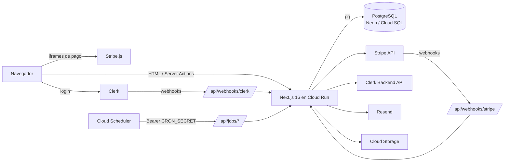

# System Design — Ticketera

- Fecha: 2026-10-03
- Estado: diseño acordado en brainstorming (pendiente de revisión del documento)
- Modelo de datos: [`erd.md`](./erd.md)
- Fuente visual de las pantallas: `Brand/Design artifact.pdf` (no versionado) y `design-system/ticketera/MASTER.md`

Este documento describe la arquitectura objetivo. No es una spec implementable: cada fase de la sección 13 se convierte en una spec en `docs/specs/` y requiere aprobación ("apruebo docs/specs/<slug>.md") antes de escribir código.

---

## 1. Contexto y objetivo

Hoy la app es solo frontend: `events` y `auth` leen mocks y el checkout (spec `checkout-purchase.md`) cobra con Stripe sin base de datos. El objetivo es una ticketera con:

- Venta de entradas con inventario por zona **mixto** (zonas generales con cupo y zonas con asientos numerados) y reserva temporal de 10 minutos.
- Reparto del dinero entre la plataforma (comisión) y los organizadores.
- Reembolsos, cancelación de evento y check-in por QR en puerta.
- Recintos reutilizables entre eventos.
- Cumplimiento legal en Perú: términos, privacidad, cookies, garantía y devoluciones, Libro de Reclamaciones, consentimientos.
- Dos entornos: local (Neon) y producción (GCP con Cloud SQL).

## 2. Decisiones

| Tema | Decisión |
|---|---|
| Backend | Monolito Next.js 16 (App Router). Server Components y Server Actions para todo lo interno; Route Handlers solo para webhooks y jobs. Código de negocio en `modules/<dominio>/` (ver `docs/SETUP.md`). |
| Base de datos | PostgreSQL. Local: Neon. Producción: Cloud SQL (GCP). |
| ORM | Drizzle con **un solo driver: `pg`** (node-postgres) en ambos entornos. |
| Auth | Clerk (correo/contraseña y Google). La BD es la fuente de verdad del rol y de los datos peruanos del usuario; el rol se replica en `publicMetadata`. |
| Pagos | Solo tarjeta, Stripe (PaymentIntent). La plataforma cobra el 100%. |
| Reparto | Comisión y neto congelados en cada orden. Liquidación al organizador con **Stripe Global Payouts** (PEN, cuenta bancaria peruana, RUC/DNI) después del evento. **Stripe Connect no se usa**: desde una plataforma en EE. UU. no paga a Perú. |
| Organizadores | Solo en Perú. Tabla `organizers` 1:1 con `users`. |
| Roles | `customer`, `organizer`, `admin`, `super_admin`. Staff de puerta por evento (`event_staff`), no es un rol. |
| Inventario | Una fila por lugar vendible (`event_seats`), también en zonas generales. Un solo mecanismo de reserva: `UPDATE … FOR UPDATE SKIP LOCKED` con expiración perezosa. |
| Recintos | Catálogo reutilizable (`venues` → `venue_sections` → `venue_seats`) gestionado por admin. |
| Correo | Resend, envío directo después del commit con reintento por job. |
| Imágenes | Google Cloud Storage. |
| Documentos legales | En la BD (markdown, versionados e inmutables al publicar), editables por `super_admin`. |
| Moneda / documentos | PEN. DNI, CE, pasaporte. |
| Región GCP | `southamerica-west1` (Santiago), la más cercana a Lima. |

## 3. Arquitectura



### Capas

```
app/                     rutas finas: leen params, componen componentes del módulo
  api/webhooks/stripe/route.ts
  api/webhooks/clerk/route.ts
  api/jobs/<job>/route.ts
modules/<dominio>/       componentes, hooks, services, schemas, types (SETUP §1)
lib/db/
  client.ts              Pool de pg + instancia de Drizzle (import "server-only")
  schema/*.ts            esquema Drizzle, un archivo por dominio
lib/env.ts               validación zod de variables de entorno (falla al arrancar)
drizzle/                 migraciones SQL generadas y versionadas
```

- El esquema vive en `lib/db/schema/` y no dentro de cada módulo porque las claves foráneas cruzan dominios y `SETUP.md` §1 regla 5 prohíbe importar internals de otro módulo.
- Los services existentes (`getEvents`, `getEventBySlug`, `login`…) cambian el mock por consultas **sin cambiar su firma**.

### Módulos

| Módulo | Responsabilidad |
|---|---|
| `events` (existe) | Listado, detalle, filtros; lee de la BD. |
| `auth` (existe) | Clerk, `ensureUser()`, sesión, `can()`. |
| `checkout` (existe) | Página de compra; usa `orders` para reservar y pagar. |
| `orders` | Reserva de asientos, órdenes, emisión de entradas, "Mis entradas". |
| `payments` | Webhooks de Stripe, reembolsos, payouts. |
| `venues` | Catálogo de recintos, secciones y asientos. |
| `organizers` | Perfil, dashboard de ventas, CRUD de eventos, `event_staff`. |
| `checkin` | Escáner y validación de QR. |
| `admin` | Gestión de usuarios y roles, eventos, reembolsos, cancelación, auditoría. |
| `complaints` | Libro de Reclamaciones. |
| `legal` | Documentos legales, consentimientos, banner de cookies. |

Solo se crean los módulos cuando su fase los necesita (SETUP §1 regla 6).

## 4. Entornos

| | Local | Producción |
|---|---|---|
| App | `npm run dev` en `http://localhost:3000` | Cloud Run, `southamerica-west1`, imagen `output: "standalone"` |
| BD | Neon, rama `dev`, conexión TCP con `pg` | Cloud SQL Postgres, misma región, socket `/cloudsql/<instancia>` (`--add-cloudsql-instances`, sin librería de conector) |
| BD de tests | Neon, rama `test` (`DATABASE_URL_TEST`) | — |
| Auth | Instancia de desarrollo de Clerk | Instancia de producción de Clerk |
| Stripe | Claves `sk_test_`/`pk_test_`; webhooks con `stripe listen --forward-to localhost:3000/api/webhooks/stripe` | Claves `sk_live_`/`pk_live_`; endpoint de webhook registrado en el Dashboard |
| Correo | Resend con clave de prueba; solo a tu correo o `delivered@resend.dev` | Resend con dominio propio verificado (SPF/DKIM) |
| Imágenes | Bucket de desarrollo | Bucket de producción |
| Secretos | `.env.local` (no versionado) | Secret Manager inyectado como variables de entorno |
| Jobs | Ejecución manual (`curl -H "Authorization: Bearer $CRON_SECRET"`) | Cloud Scheduler |
| Migraciones | `npx drizzle-kit migrate` | Cloud Run Job con el usuario `migrator`, antes de cada deploy |

Mismo código en ambos entornos: solo cambian las variables.

### Variables de entorno (validadas en `lib/env.ts`)

| Variable | Uso |
|---|---|
| `DATABASE_URL` | Conexión de la app (usuario `app`, solo DML). |
| `DATABASE_URL_MIGRATOR` | Solo el job de migraciones (usuario `migrator`, DDL). |
| `DATABASE_URL_TEST` | Solo tests de integración (local). |
| `NEXT_PUBLIC_CLERK_PUBLISHABLE_KEY`, `CLERK_SECRET_KEY`, `CLERK_WEBHOOK_SIGNING_SECRET` | Clerk. |
| `NEXT_PUBLIC_STRIPE_PUBLISHABLE_KEY`, `STRIPE_SECRET_KEY`, `STRIPE_WEBHOOK_SECRET` | Stripe. En local solo se aceptan claves de test; en producción, live. |
| `RESEND_API_KEY`, `EMAIL_FROM` | Correo. |
| `CRON_SECRET` | Autenticación de `/api/jobs/*`. |
| `GCS_BUCKET` | Imágenes de portada. |
| `NEXT_PUBLIC_GOOGLE_MAPS_API_KEY` (opcional) | Mapa del recinto; sin clave no se muestra el mapa. |
| `APP_URL` | URLs absolutas (correos, `return_url` de Stripe). |

### Pool de conexiones

Cada instancia de Cloud Run abre un `Pool` de `pg`. Regla: `max_instances × pool.max + margen (migraciones, consola) ≤ max_connections` de Cloud SQL. Valores iniciales: `pool.max = 5`, `max_instances = 10` (50 conexiones). Ajustar al tamaño real de la instancia.

## 5. Integraciones

### Clerk
- Login con correo/contraseña y Google. `LoginForm`/`RegisterForm` se recablean con `useSignIn`/`useSignUp`; celular y documento se guardan en `users` (Clerk no los guarda).
- `ensureUser()` hace upsert por `clerk_id` en el primer acceso autenticado (no hace falta túnel en local).
- Webhook (verificado con svix): `user.updated` sincroniza nombre y correo; `user.deleted` anonimiza el usuario y conserva sus órdenes.
- Cambio de rol: BD → `clerkClient.users.updateUserMetadata(..., { publicMetadata: { role } })` → `audit_logs`.
- Clerk guarda datos en EE. UU.: requiere el consentimiento `international_transfer` (Ley 29733).

### Stripe
- **Pagos:** PaymentIntent (`currency: "pen"`, `payment_method_types: ["card"]`), importe tomado de la orden en el servidor, `idempotencyKey = order.id`, `metadata.order_id`.
- **Webhooks:** `payment_intent.succeeded`, `refund.updated`, eventos de payouts. Firma verificada con `constructEvent`; idempotencia con `stripe_events`.
- **Reembolsos:** `stripe.refunds.create` con `idempotencyKey = refund.id`.
- **Global Payouts:** el organizador se registra como destinatario (RUC o DNI, cuenta bancaria en Stripe); en la BD solo `organizers.stripe_recipient_id`. **Riesgo:** Global Payouts debe estar habilitado en la cuenta Stripe; confirmar antes de la fase F7.

### Resend
Correos de esta etapa:

| Correo | Disparador |
|---|---|
| Copia del reclamo | Registro en el Libro de Reclamaciones (obligatorio) |
| Respuesta al reclamo | Admin responde (obligatorio) |
| Confirmación de compra con entradas (QR) | Orden pagada |
| Evento cancelado y reembolso | Cancelación de evento |

- Se envía **después del commit**. Si falla, se registra y la operación no se revierte.
- Reintento sin outbox: columnas `orders.tickets_emailed_at` y `complaints.receipt_emailed_at`; un job reenvía las que siguen en `NULL`.
- Plantillas como componentes React pasados al SDK (`react:`).

### Cloud Storage
Portadas de evento (JPG/PNG, 16:9). Subida desde el servidor tras validar tipo y tamaño.

### Google Maps (opcional)
`venues` guarda `lat`, `lng`, `place_id`. La UI muestra el mapa solo si existe la API key.

## 6. Roles y permisos

| Acción | Invitado | customer | organizer | admin | super_admin |
|---|:-:|:-:|:-:|:-:|:-:|
| Ver eventos y comprar | ✓ | ✓ | ✓ | ✓ | ✓ |
| "Mis entradas" y perfil | | ✓ | ✓ | ✓ | ✓ |
| Registrar reclamo | ✓ | ✓ | ✓ | ✓ | ✓ |
| Crear, editar y publicar **sus** eventos | | | ✓ | | |
| Ver **sus** ventas y liquidaciones | | | ✓ | | |
| Asignar `event_staff` en **sus** eventos | | | ✓ | ✓ | ✓ |
| Check-in en **sus** eventos | | | ✓ | ✓ | ✓ |
| Ver y editar **todos** los eventos, despublicar | | | | ✓ | ✓ |
| Cancelar evento | | | | ✓ | ✓ |
| Reembolsar entradas | | | | ✓ | ✓ |
| Responder reclamos | | | | ✓ | ✓ |
| Gestionar catálogo de recintos | | | | ✓ | ✓ |
| Dar/quitar `organizer`, gestionar usuarios | | | | ✓ | ✓ |
| Crear/quitar `admin` | | | | | ✓ |
| Comisiones, categorías, documentos legales | | | | | ✓ |
| Ver `audit_logs` | | | | | ✓ |

- **Invitado:** compra sin cuenta (`orders.user_id NULL`, datos en `buyer_*`).
- **Staff de puerta:** cualquier usuario asignado en `event_staff`; solo hace check-in en ese evento.
- El registro público siempre crea `customer`. El primer `super_admin` se crea por seed/CLI.
- Nadie se asigna un rol a sí mismo ni asigna un rol igual o superior al propio.
- El organizador solo accede a eventos con `events.organizer_id` propio.
- Defensa en profundidad: `proxy.ts` filtra rutas por `publicMetadata.role`; **cada Server Action vuelve a validar** con `can(user, action, resource)` contra la BD.

## 7. Flujos críticos

### 7.1 Compra: reserva, pago y emisión

```mermaid
sequenceDiagram
  participant C as Comprador
  participant A as Server Actions
  participant DB as Postgres
  participant S as Stripe
  C->>A: reserveSeats(evento, zonas/cantidades o asientos)
  A->>DB: tx: INSERT order pending (expires_at = now()+10min)<br/>UPDATE event_seats ... SKIP LOCKED
  alt menos asientos de los pedidos
    A->>DB: ROLLBACK
    A-->>C: "Sin cupo"
  end
  C->>A: createPayment(orderId, comprador)
  A->>DB: orden pending y no vencida
  A->>S: PaymentIntent (importe de la orden, idempotencyKey=order.id)
  C->>S: confirmPayment (iframe)
  S->>A: webhook payment_intent.succeeded
  A->>DB: INSERT stripe_events (si existe: 200 y fin)
  A->>DB: tx: orden FOR UPDATE; asientos con order_id = orden → sold;<br/>INSERT tickets (qr_token); orden paid
  A->>C: correo con entradas (después del commit)
```

1. **Reserva (`reserveSeats`)**, en una transacción:
   - Crea la orden `pending` con `expires_at = now() + 10 min`, precios y comisión calculados en el servidor (`organizers.commission_bps`).
   - Toma los asientos:
     ```sql
     UPDATE event_seats
     SET status = 'held', order_id = $order, held_until = now() + interval '10 minutes'
     WHERE id IN (
       SELECT id FROM event_seats
       WHERE ticket_type_id = $zone
         AND (status = 'available' OR (status = 'held' AND held_until < now()))
       ORDER BY venue_seat_id NULLS LAST, id
       LIMIT $n
       FOR UPDATE SKIP LOCKED
     )
     ```
     En zonas numeradas con elección manual, `WHERE id = ANY($ids)` en vez de `LIMIT`; si alguno ya no está libre, rollback con "Ese asiento acaba de ocuparse". Asignación automática: mejores asientos por orden de fila y número.
   - Si se obtuvieron menos filas que las pedidas: rollback, "Sin cupo".
2. **Pago (`createPayment`)**: solo si la orden está `pending` y `expires_at > now()`. Importe de la orden, nunca del cliente.
3. **Webhook `payment_intent.succeeded`**:
   - `INSERT` en `stripe_events`; si ya existía, responder 200 y terminar.
   - Bloquear la orden (`FOR UPDATE`). Si sus asientos **siguen con `order_id` de esta orden** (aunque `held_until` haya vencido): asientos → `sold`, crear `tickets` con `qr_token`, orden → `paid`, `paid_at`.
   - Si otro comprador tomó los asientos: reembolso automático completo y orden → `refunded`.
   - Tras el commit: correo con entradas.
4. **Abandono:** nada que hacer (expiración perezosa). Un job diario marca órdenes vencidas como `expired` y sus `held` como `available` (limpieza cosmética).

### 7.2 Reembolso (admin)
- El admin elige entradas → `refund` `pending` + `audit_logs` → `stripe.refunds.create` (`idempotencyKey = refund.id`).
- Webhook `refund.updated` `succeeded` → entradas `refunded`, asientos `available`, orden `refunded` o `partially_refunded`.
- No se reembolsan entradas `used` ni eventos con payout `paid`.

### 7.3 Cancelación de evento (admin o super_admin)
- Transacción: evento → `cancelled` (`cancelled_at`, `cancel_reason`), `audit_logs`; su payout queda bloqueado.
- Job `/api/jobs/refund-cancelled`: por lotes, un `refund` por orden `paid` con `reason = event_cancelled` por el **100%, incluida la comisión**. Índice único parcial `(order_id) WHERE reason = 'event_cancelled'` hace el job reintentable sin duplicar.
- Entradas → `void`; correo de cancelación.

### 7.4 Check-in en puerta
- `/checkin/[eventId]`, accesible para `event_staff`, el organizador del evento y admins.
- `checkIn(qrToken, eventId)`:
  ```sql
  UPDATE tickets SET status = 'used', checked_in_at = now(), checked_in_by = $user
  WHERE qr_token = $token AND status = 'valid'
    AND order_id IN (SELECT id FROM orders WHERE event_id = $event)
  RETURNING id
  ```
  Si no devuelve fila, se consulta el motivo (`already_used`, `invalid`, `wrong_event`, `void`). Cada intento se registra en `check_in_scans`.
- Respuesta en pantalla: ok (titular, zona, asiento), ya usada, inválida, otro evento, anulada.
- Check-in sin conexión: fuera de esta etapa.

### 7.5 Liquidación (job diario)
- Eventos con `starts_at` hace más de 24 h → `finished`.
- Si no hay reembolsos `pending`, el organizador tiene `payouts_enabled` y no hay payout: crear `payout` = Σ `organizer_amount_cents` de órdenes pagadas − parte reembolsada. Enviar con Global Payouts; webhook actualiza `status`.

### 7.6 Libro de Reclamaciones
- Formulario público `/libro-de-reclamaciones` con razón social, RUC y dirección de la plataforma visibles.
- Transacción: `UPDATE complaint_counters SET last_number = last_number + 1 WHERE year = $y RETURNING last_number` + `INSERT complaints` (correlativo anual sin huecos; una sequence dejaría huecos con rollback).
- `due_at` = +15 días hábiles (Ley 31435; confirmar con legal). `ponytail:` solo excluye sábados y domingos; agregar tabla de feriados cuando haga falta.
- Copia por correo al registrar; admin responde → `audit_logs` → correo con la respuesta. Panel admin muestra vencidos. Conservación mínima de 2 años; no se borran.

### 7.7 Sincronización de usuarios
Ver §5 Clerk.

### 7.8 Documentos legales y consentimientos
- `super_admin` edita en markdown (textarea con vista previa), guarda borrador y publica. Publicado = inmutable; corregir = nueva versión. Queda en `audit_logs`.
- Render con `react-markdown` **sin `rehype-raw`** (no interpreta HTML crudo: sin XSS).
- Versión vigente = última `published` de cada `kind`.
- Nueva versión de `terms`, `privacy` o `refunds`: el usuario con sesión debe reaceptar antes de comprar (pantalla "Actualizamos nuestros términos"). `cookies` reabre el banner. `marketing` solo se informa.
- Consentimientos solo se agregan: retirar = fila nueva con `accepted = false`; vigente = última fila.
- Mapeo: `acceptTerms` del registro/checkout → `terms` + `privacy` (+ `refunds` en checkout); `marketingOptIn` → `marketing`; registro → `international_transfer`.

### 7.9 Banner de cookies
Base legal: D.S. 016-2024-JUS (reglamento de la Ley 29733, vigente desde el 31/03/2025): cookies de analítica/publicidad y píxeles requieren consentimiento previo, libre, expreso e informado; las esenciales no.

- Panel inferior no bloqueante (`role="dialog"`) en la primera visita, antes de cargar cualquier script no esencial.
- Botones **"Aceptar todas"** y **"Rechazar"** con el mismo peso visual, y **"Configurar"** (interruptores por categoría). Enlaces a `/cookies` y `/privacidad`.
- Categorías: `necessary` (siempre activa), `analytics` y `marketing` (apagadas por defecto).
- Ningún script de analítica o marketing se carga sin consentimiento: `<ConsentGate category="analytics">`.
- Visitante: cookie `cookie_consent` (versión + categorías, 12 meses). Usuario con sesión: además filas en `consents` (`scope` = categoría).
- "Configurar cookies" en el footer reabre el panel (retirar tan fácil como aceptar). Nueva versión de la política → el banner vuelve a aparecer.
- El componente lee la cookie en el cliente (no se usa `cookies()` en el layout, para no volver dinámicas todas las páginas). La versión vigente se lee de la BD con caché invalidada al publicar (`revalidateTag`).

## 8. Páginas legales

| Documento | Ruta | `legal_documents.kind` | Aceptación |
|---|---|---|---|
| Términos y condiciones | `/terminos` | `terms` | Registro y checkout (obligatoria) |
| Política de privacidad | `/privacidad` | `privacy` | Registro y checkout (obligatoria) |
| Política de cookies | `/cookies` | `cookies` | Banner de cookies |
| Garantía y devoluciones | `/devoluciones` | `refunds` | Checkout (obligatoria) |
| Libro de Reclamaciones | `/libro-de-reclamaciones` | — (tabla `complaints`) | — |
| Publicidad | — | `marketing` | Registro (opcional) |
| Transferencia internacional | Sección de privacidad | `international_transfer` | Registro (obligatoria) |

- El footer de todas las páginas enlaza los cinco documentos y "Configurar cookies". El Libro de Reclamaciones, con su ícono, visible desde la home.
- Estado actual (2026-10-03) de `components/shared/SiteFooter.tsx`, columna "Ayuda": enlaza `/terminos`, `/privacidad` y `/libro-de-reclamaciones` (con ícono), pero **ninguna de esas rutas existe en `app/` (404)**. **Faltan** los enlaces `/cookies` y `/devoluciones` y el botón "Configurar cookies" (botón, no enlace: reabre el banner). Se resuelve en F2 (páginas legales) y F4 (formulario del Libro de Reclamaciones).
- La política de devoluciones debe coincidir con el sistema: cancelación de evento = 100% automático; pedido del cliente = lo evalúa un admin; nunca entradas usadas ni eventos liquidados.
- Seed: versión `1.0` de cada documento marcada "BORRADOR – revisión legal pendiente". **Redacción final: abogado peruano** (Ley 29571, Ley 29733 y su reglamento, reglamento del Libro de Reclamaciones).

## 9. Manejo de errores

- **Errores esperados:** unión tipada devuelta por los services (`{ status: "no-capacity" } | { status: "expired" } | { status: "ok", … }`), mismo patrón que `CheckoutOrderResult`.
- **Errores inesperados:** se lanzan; los captura `error.tsx`.
- **Webhooks:** firma verificada; 2xx solo después del commit; 5xx provoca reintento del emisor, sin duplicar gracias a `stripe_events`.
- **Jobs:** idempotentes, por lotes, autenticados con `Authorization: Bearer <CRON_SECRET>`.
- **Stripe falla tras reservar:** la orden queda `pending` y vence sola.
- **Correo falla:** se registra; reintento por job (§5 Resend).

## 10. Seguridad

- zod en toda frontera (Server Actions, webhooks, jobs, formularios públicos) y `can()` en servidor en cada acción.
- Dos usuarios de BD: `app` (DML) y `migrator` (DDL, solo el job de migraciones).
- Límites anti-abuso en Postgres (sin Redis): N órdenes `pending` por correo/IP cada 10 min, `max_per_order` por zona, tope de entradas por documento y evento, límite por IP en el Libro de Reclamaciones.
- `qr_token`: 128 bits aleatorios, nunca secuencial; el código `TK-…` no sirve para entrar.
- Datos de tarjeta solo en iframes de Stripe; datos bancarios solo en Stripe.
- Datos personales cifrados en reposo por Neon y Cloud SQL. `ponytail:` sin cifrado por columna del número de documento; agregar si una auditoría lo exige.
- Markdown legal sin HTML crudo.

## 11. Testing

- **Unitarios (Vitest):** funciones puras: precio, comisión y neto; `due_at` en días hábiles; matriz `can()`; formato de códigos; cálculo de payout.
- **Integración contra Postgres real** (rama `test` de Neon, `DATABASE_URL_TEST`, `TRUNCATE` entre tests). PGlite no sirve: no tiene concurrencia real. Casos obligatorios:
  - Dos reservas en paralelo por el último asiento: gana una.
  - Webhook `payment_intent.succeeded` duplicado: emite una vez.
  - Doble escaneo del mismo QR: el segundo devuelve `already_used`.
  - Job de cancelación ejecutado dos veces: no duplica reembolsos.
  - Correlativo de reclamos sin huecos bajo concurrencia.
- **Manual:** `stripe listen` y `stripe trigger` para webhooks.

## 12. Códigos

- Orden: `TK-` + número de la sequence `order_code_seq` (huecos aceptables).
- Entrada: código de la orden + `-01`, `-02`…
- Reclamo: `000123-2026` (correlativo anual sin huecos).

## 13. Fases de implementación

Cada fase es una spec en `docs/specs/` con su aprobación.

| # | Fase | Contenido |
|---|---|---|
| F1 | Fundación de datos | Drizzle + `pg`, `lib/env.ts`, esquema completo y migraciones, seed desde los mocks (recintos, secciones, asientos, eventos); `events` lee de la BD. |
| F2 | Identidad y legal | Clerk, `users`, roles, `ensureUser`, webhook, `proxy.ts`, documentos legales con editor, páginas legales y footer, consentimientos, reaceptación, banner de cookies. |
| F3 | Compra | Reserva, PaymentIntent, webhook, entradas con QR, correos (Resend), "Mis entradas". Reemplaza las fases 2 y 3 de `checkout-purchase.md`. |
| F4 | Libro de Reclamaciones y admin | Formulario público, respuestas, reembolsos, cancelación de evento, gestión de roles, `audit_logs`. |
| F5 | Organizadores | Dashboard, crear evento, catálogo de recintos, `event_staff`. |
| F6 | Check-in | Escáner en puerta. |
| F7 | Liquidación | Global Payouts (requiere habilitación de Stripe). |
| F8 | Producción GCP | Cloud Run, Cloud SQL, Secret Manager, Cloud Scheduler, Cloud Storage, CI/CD, migraciones como Cloud Run Job. |

F1 se implementa primero; el resto se especifica cuando le toque.

## 14. Fuera de alcance (trabajo futuro)

- Yape, PagoEfectivo, billeteras.
- Multimoneda (la columna `currency` lo deja abierto).
- Disputas y contracargos (`charge.dispute.created`).
- Outbox de correos.
- Cortesías e invitaciones.
- Reprogramación de eventos.
- Comprobantes electrónicos SUNAT (`invoices`) e impuestos (IGV, espectáculos públicos).
- Transferencia de entradas entre personas.
- Mapa de asientos numerados en la UI (el modelo ya lo soporta).
- Check-in sin conexión.
- Cupones, newsletter, staging, cola o sala de espera para picos de demanda.
- Organizaciones con varios miembros.

## 15. Riesgos y preguntas abiertas

1. **Global Payouts** debe estar habilitado en la cuenta Stripe de EE. UU. Confirmar antes de F7.
2. **Revisión legal** de los textos, del plazo del Libro de Reclamaciones y de la política de devoluciones.
3. **SUNAT e impuestos:** quién emite la boleta de la entrada (plataforma como agente u organizador) e IGV sobre la comisión. Requiere contador antes de producción.
4. **Feriados** no considerados en `due_at`.
5. **Picos de venta** (eventos masivos): `SKIP LOCKED` reduce la contención; medir antes de decidir una sala de espera.
6. **Tamaño de Cloud SQL y pool** a ajustar con carga real.
